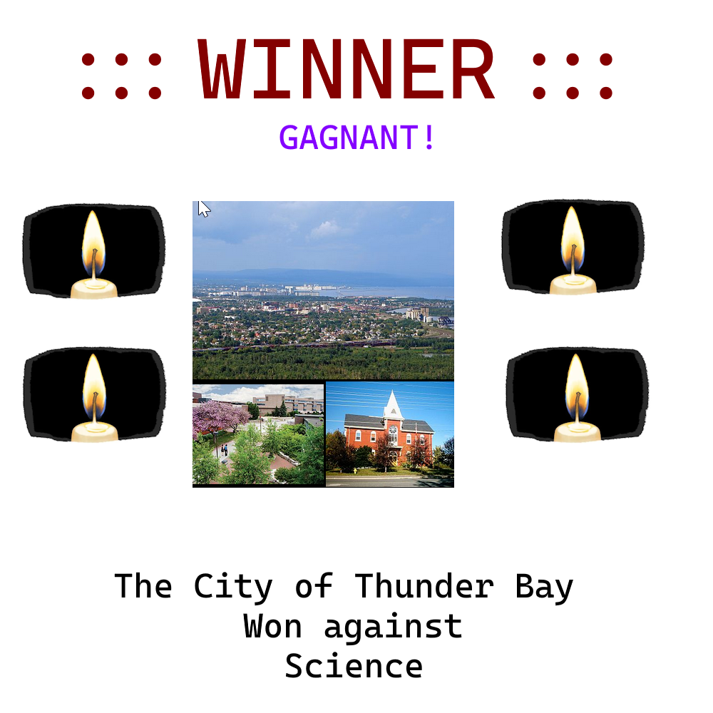

# Design "Fight" results page frontend
The fight results will actually be an alert as opposed to a page itself. It will appear like a “Wordle” with an overlay appearing when the fight concludes and with an “x” button that you can close the overlay with. It should indicate the winner in a fancy font. And it should also indicate the defeated party. This popup should have access to the URL for the image of the fighter from the database in order to insert the image into the html tag using on the URL.

(See FightResultsWireframe.png)
