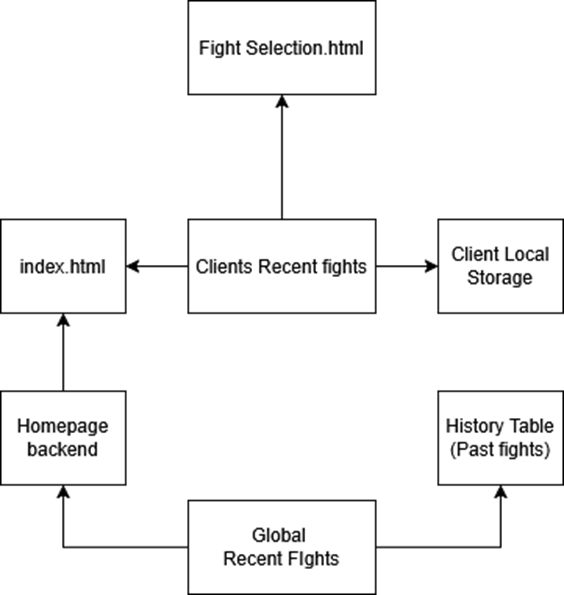

<<<<<<< HEAD
# Recent Fights Backend Design

There are two sets of recent fights for our webpage. The client side locally stored recent fights, and the globally stored recent fights that are created by any user on our website. The Global Recent fights is related to the History Table to access previous fights, giving the Homepage backend access to the history of fights to be displayed on the index.html page. The Clients Recents fights will be related to their locally stored data on their browser, alongside the fight selection page.

=======
# Recent Fights Backend Design

There are two sets of recent fights for our webpage. The client side locally stored recent fights, and the globally stored recent fights that are created by any user on our website. The Global Recent fights is related to the History Table to access previous fights, giving the Homepage backend access to the history of fights to be displayed on the index.html page. The Clients Recents fights will be related to their locally stored data on their browser, alongside the fight selection page.

>>>>>>> b0f49e1 (I messed up files, attempting to fix and rearange.)
